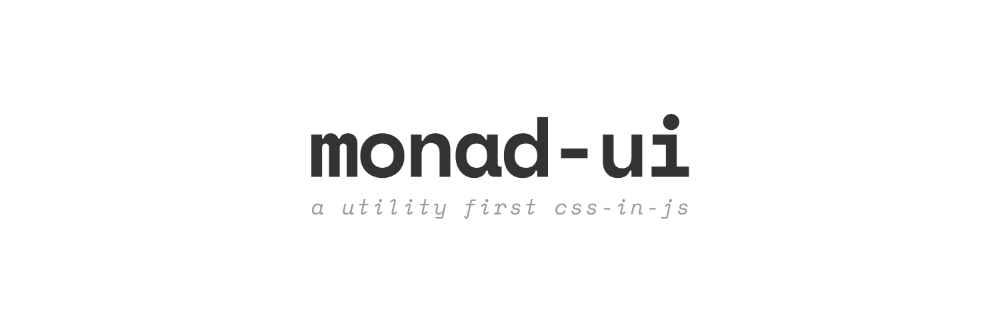

<!-- markdownlint-disable MD014 MD033 MD041 -->



<div align=center>

Inspired by [Rebass](https://github.com/rebassjs/rebass), [TailwindCSS](https://github.com/tailwindcss/tailwindcss), [Smooth UI](https://github.com/smooth-code/smooth-ui), and [Material UI](https://github.com/mui-org/material-ui). <br>
Implemented in [Emotion](https://github.com/emotion-js/emotion).


</div>

---

- [Usage](#usage)
  - [Basic example](#basic-example)
  - [Responsive styles](#responsive-styles)
- [Static vs Dynamic APIs](#static-vs-dynamic-apis)
- [Available APIs](#available-apis)
- [FAQs](#faqs)
- [License](#license)

---

## Usage

### Basic example

```sh
# using npm
npm install monad-ui

# using yarn
yarn add monad-ui
```

```jsx
import * as S from 'monad-ui';

// blue background
function Example() {
  return (
    <div css={S.bg('blue')}>
      Lorem ipsum dolor sit, amet consectetur adipisicing elit.
    </div>
  );
}

// blue background and red text color
function Example() {
  return (
    <div css={[S.bg('blue'), S.color('red')]}>
      Lorem ipsum dolor sit, amet consectetur adipisicing elit.
    </div>
  );
}
```

### Responsive styles

Monad UI has four breakpoints ([view source](https://github.com/muhajirdev/monad-ui/blob/master/src/index.js#L8-L13)):

```js
const breakpoints = {
  sm: '576px',
  md: '768px',
  lg: '992px',
  xl: '1200px'
};
```

There are many ways to implement responsive styles:

1. **Array Responsive API**

   ```js
   import * as S from 'monad-ui';

   function Example() {
     return (
       <div css={S.bg(['red', 'green', 'blue'])}>
         Lorem ipsum dolor sit, amet consectetur adipisicing elit.
       </div>
     );
   }
   ```

   Example above will change the `div`'s `background` to `red`. When the screen size is above `576px`, it will be `green`. When the screen size is above `768px`, it will be `blue`. And so on.

2. **Object Responsive API**

   ```js
   import * as S from 'monad-ui';

   function Example() {
     return (
       <div css={S.bg({ sm: 'red', lg: 'blue' })}>
         Lorem ipsum dolor sit, amet consectetur adipisicing elit.
       </div>
     );
   }
   ```

   Note that `md` is not specified. When it's not specified, it will take the previous value, which is `red` in this case.

3. **Higher-order Function Responsive API**

   ```js
   import * as S from 'monad-ui';

   function Example() {
     return (
       <div css={S.up('sm')(S.hidden)}>
         Lorem ipsum dolor sit, amet consectetur adipisicing elit.
       </div>
     );
   }
   ```

   Example above will hide the `div` when the screen size is above `576px`.

   ```js
   import * as S from 'monad-ui';

   function Example() {
     return (
       <div css={S.up('sm')(S.bg('blue'))}>
         Lorem ipsum dolor sit, amet consectetur adipisicing elit.
       </div>
     );
   }
   ```

   Example above will change the `div`'s `background` into `blue` when the screen size is above `576px`.

## Static vs Dynamic APIs

- Dynamic type accept arguments (e.g. `S.bg('blue')`).
- Static type does not accept arguments. (e.g. `S.down('md')(S.hidden)`).

| Type    | Array Responsive API | Object Responsive API | High Order Responsive API |
| ------- | -------------------- | --------------------- | ------------------------- |
| Dynamic | ✅                   | ✅                    | ✅                        |
| Static  | ❌                   | ❌                    | ✅                        |

## Available APIs

View all available APIs at [`./docs/available-apis.md`](./docs/available-apis.md).

## FAQs

- **Do I always have to `import * as S from 'monad-ui'`?**

  If you only use a few styles, you can also import and use like this:

  ```js
  import { bg, hidden } from 'monad-ui';

  function Example() {
    return (
      <div css={bg('blue')}>
        Lorem ipsum dolor sit, amet consectetur adipisicing elit.
      </div>
    );
  }
  ```

- **Too many styles?**

  Consider extracting your style outside like this:

  ```js
  import { css } from '@emotion/core';
  import { bg, color } from 'monad-ui';

  const style = css([bg('blue'), color('red')]);

  function Example() {
    return (
      <div class={style}>
        Lorem ipsum dolor sit, amet consectetur adipisicing elit.
      </div>
    );
  }
  ```

## License

[ISC License, Copyright (c) 2020, Muhammad Muhajir](./LICENSE)
